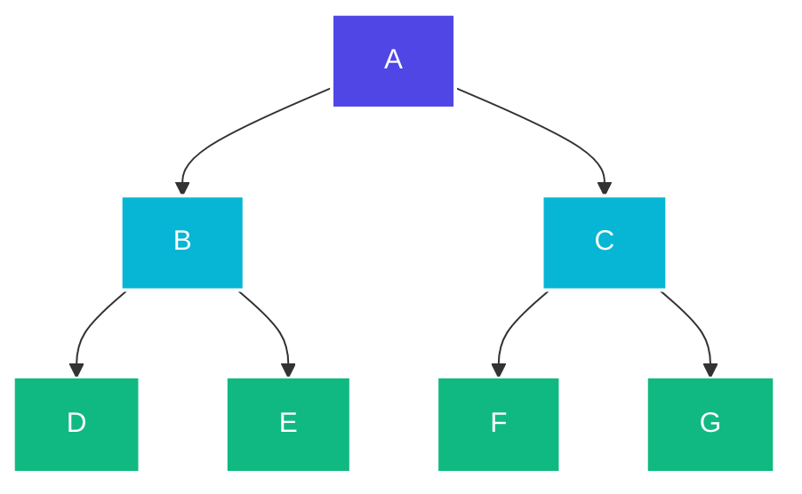

# 🧠 Fundamentals of Artificial Intelligence

[](https://www.python.org/)
[](https://en.wikipedia.org/wiki/Breadth-first_search)

This repository contains educational implementations of essential Artificial Intelligence algorithms, focused primarily on search strategies, graph traversal methods, and foundational problem-solving heuristics.

---

## 🔍 Implemented Algorithms

### 1. Breadth-First Search (BFS)
* **File:** [`bfs.py`](bfs.py)
* **Description:** A classic uninformed search strategy used to traverse or explore tree/graph data structures level-by-level. Starting from a root node, BFS expands all neighboring nodes at the current depth level before moving to the next depth layer.
* **Complexity:** Time Complexity $\mathcal{O}(V + E)$, Space Complexity $\mathcal{O}(V)$ (where $V$ is vertices and $E$ is edges).
* **Usage:** Used for finding the shortest path on unweighted graphs and checking connectivity components.

#### logic Flow

The traversal order of the above graph using BFS starting at **A** is:
$$\text{A} \rightarrow \text{B} \rightarrow \text{C} \rightarrow \text{D} \rightarrow \text{E} \rightarrow \text{F} \rightarrow \text{G}$$

---

## 🚀 How to Run

### Setup
Ensure you have Python installed on your computer.

### BFS Execution
Run the following script to see the graph traversal:
```bash
python bfs.py
```

### Test Script
To execute the quick diagnostics file:
```bash
python test.py
```
